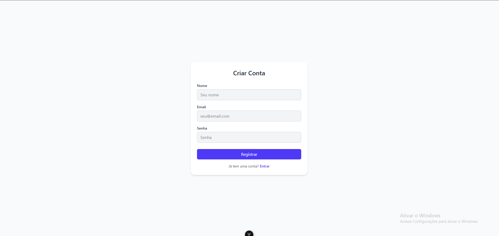
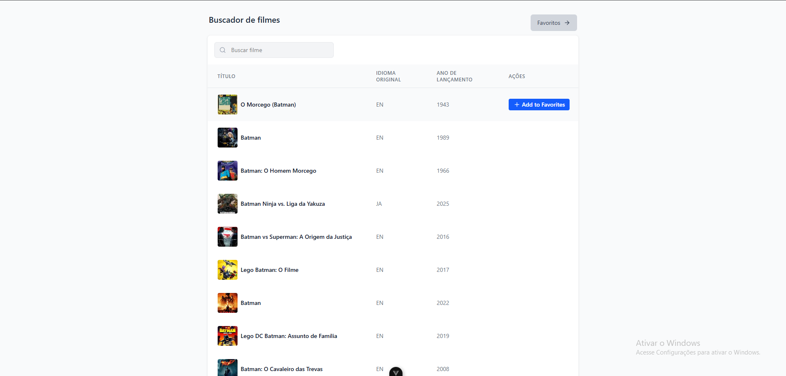
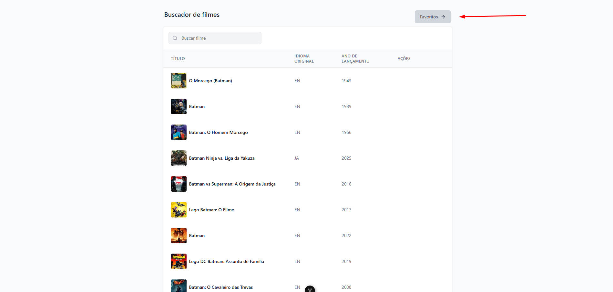
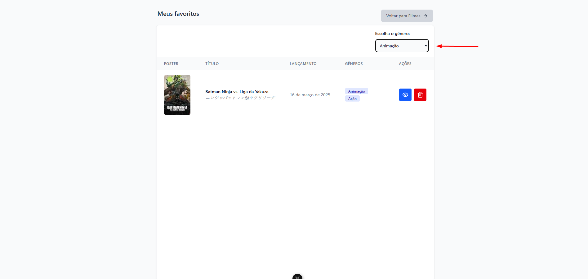
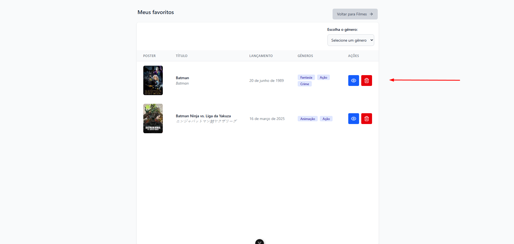

# kinghost-test

## Projeto Laravel + Vue

Este projeto utiliza Laravel no backend e Vue.js no frontend. A seguir, estão as instruções para rodar o projeto manualmente, mas recomendo o uso do script `setup.sh` e `migrate.sh` para automação do processo.

## Pré-requisitos

Antes de rodar o projeto, é necessário ter as seguintes ferramentas instaladas:

- [Docker](https://www.docker.com/get-started)
- [Docker Compose](https://docs.docker.com/compose/install/)

### Observações

- O script `setup.sh` e `migrate.sh` automatiza o processo de configuração e execução dos containers, tornando o processo mais simples e rápido. 
- **Certifique-se de preencher a variável de ambiente TMDB_API_KEY no arquivo `.env`** com as informações corretas, especialmente para integração com a **TMDB**, após rodar o script.

## Passo a Passo

### 1. Clonando o Repositório
Primeiro, clone o repositório para sua máquina local:

```bash
  git https://github.com/Cleyfson/kinghost-test
  cd kinghost-test
```

## 2. Execute o arquivo setup.sh e migrate.sh que está no root do projeto

```bash
./setup.sh
./migrate.sh
```

Caso você encontre problemas de permissão ao rodar os arquivos `.sh`, é possível que o script não tenha permissão de execução. Para corrigir isso, execute o comando abaixo antes de rodá-los:

```bash
chmod +x setup.sh
chmod +x migrate.sh
```

## Passo a Passo manual

### 1. Clonando o Repositório

Primeiro, clone o repositório para sua máquina local:

```bash
git clone https://github.com/Cleyfson/kinghost-test
cd kinghost-test
```

## 2. Configuração do Ambiente

### 2.1 Configuração da API (Backend)

Navegue até o diretório `api`:

```bash
cd api
cp .env.example .env
```

### 2.2 Configuração do Frontend
Navegue até o diretório `frontend`:

```bash
cd fronted
cp .env.example .env
```

## 3. Subindo os Containers

Execute o comando abaixo para iniciar os containers. O Docker irá construir as imagens e subir os containers em segundo plano:

```bash
docker-compose up --build -d
```

Isso vai iniciar os seguintes containers:

Backend (laravel_app)
Frontend (vue_frontend)
Banco de Dados (laravel_db)
Webserver (laravel_webserver)

## 4. Configurando aplicação

Depois disso, execute os comandos abaixo para configurar a aplicação:

```bash
docker exec laravel_app php artisan key:generate
docker exec laravel_app php artisan jwt:secret
docker exec laravel_app php artisan migrate --seed
```

## 5. Configurando TMBD info no .env

A aplicação utiliza a API da The Movie Database (TMDB). Para funcionar corretamente, você precisa de uma chave válida.

Como obter:
1. Acesse: https://www.themoviedb.org/

2. Crie uma conta gratuita.

3. Vá em Configurações da conta > API.

4. Solicite uma chave de API v3.

5. Copie a chave e adicione no .env do Laravel:

```bash
TMDB_API_KEY=sua_chave_aqui
```
## 6. CRUD de Favoritos

A API foi construída seguindo os princípios de Domain-Driven Design (DDD), que organiza o projeto em camadas bem definidas com foco na separação de responsabilidades. A estrutura está centralizada no diretório api/app/, distribuída principalmente entre as camadas:

| Diretório | Descrição |
| --- | --- |
| Application/UseCases/ | Contém os casos de uso da aplicação, separados por domínio (Auth, Favorite, Movie, etc). Cada caso de uso representa ações específicas de negócio como "favoritar filme", "listar favoritos", "login de usuário", etc. |
| Domain/Entities/ | Entidades do domínio com as regras fundamentais de negócio. Por exemplo, Fvorite, User, etc. |
| Domain/Repositories/ | Interfaces que descrevem como o domínio interage com fontes de dados. |
| Domain/Contracts/ | Contratos gerais usados no domínio, como provedor de API externa, etc. |
| Infra/Repositories/ | Implementações concretas dos repositórios definidos em Domain/Repositories/. |
| Infra/Services/ | Implementações de serviços como chamadas à API do TMDB, etc. |
| Http/Controllers/ | Camada de controle das requisições HTTP. Recebe a requisição, chama o caso de uso apropriado e retorna uma resposta. |
| Http/Requests/ | Validações centralizadas de entrada para as requisições da API. |
| routes/api.php | Define as rotas expostas pela API e os controladores responsáveis. |

O fluxo de Favoritos está implementado dentro do contexto de DDD, com as responsabilidades divididas entre as camadas Application, Domain e Infra.

| Diretório | Descrição |
| --- | --- |
| UseCases | Application/UseCases/Favorite/ |
| Controller | Http/Controllers/FavoriteController.php |
| Request | Http/Requests/StoreFavoriteRequest.php |
| Entidade | Domain/Entities/Favorite.php |
| Repositório (Interface) | Domain/Repositories/FavoriteRepositoryInterface.php |
| Repositório (Implementação) | Infra/Repositories/FavoriteRepository.php |
| Serviço externo | Infra/Services/TmdbService.php |
| Frontend | frontend/src/views/FavoriteView.vue e componentes em frontend/src/components/favorite |

## 7. Como testar a aplicação

Após subir os containers e executar as migrações, você pode acessar a aplicação nos seguintes endereços:

Backend (Laravel): http://localhost:8000

Frontend (Vue.js): http://localhost:5173

## Testar via Postman

[](https://app.getpostman.com/run-collection/26530639-ac71833c-0986-4236-a0f5-ee3b1e64d699?action=collection%2Ffork&source=rip_markdown&collection-url=entityId%3D26530639-ac71833c-0986-4236-a0f5-ee3b1e64d699%26entityType%3Dcollection%26workspaceId%3Dfc325331-2775-4bfb-a306-e3ced2794eba)

## Testes automatizados

Para rodar os testes automatizados execute o seguinte comando no root do projeto

docker exec laravel_app php artisan test
docker exec vue_frontend npm run test:unit

## Interface da Aplicação

Ao acessar a aplicação em http://localhost:5173, você será direcionado para a tela de login.

Um usuário de teste já foi criado com alguns filmes favoritados:

**Email:** test@example.com  
**Senha:** password

Caso deseje, é possível criar um novo usuário clicando em "Criar uma nova conta" na tela de login.

| Tela de Login | Tela de Registro |
|---------------|------------------|
|  |  |

Após o login, você será redirecionado para a tela inicial de filmes. Por padrão, o termo "Batman" é utilizado na busca automática, então você verá inicialmente uma lista de filmes relacionados ao personagem.

Você pode buscar por outros filmes digitando o nome na barra de busca. Para adicionar um filme aos favoritos, passe o mouse sobre o card do filme desejado – o botão "Adicionar aos favoritos" será exibido. Basta clicar nele.

Para visualizar seus filmes favoritos, clique em "Favoritos" na barra superior.

| Tela inicial com filmes do Batman | Tela com busca por nome | Tela mostrando o botão de favoritos |
|-----------------------------------|-------------------------|-------------------------------------|
|  |  |  |

Na tela de Favoritos, você verá todos os filmes que foram marcados como favoritos pelo usuário.

Na parte superior, é possível filtrar os filmes por gênero. Além disso, cada card de filme possui botões de ação para:

- 👁 Ver detalhes
- 🗑 Remover dos favoritos

| Lista filtrada por gênero | Ações nos favoritos |
|---------------------------|---------------------|
|  |  |